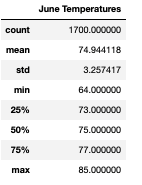
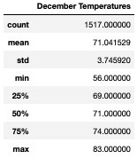
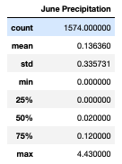
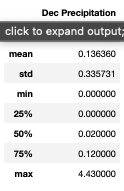

# surfs_up

## Overview
- I was asked by surfing legend W. Avy to analyze temperatures in the island of Oahu in Hawaii to see if it is worth his money to invest in an ice cream store that is also a surf shop. He specifically wanted me to analyze two months (Jue and December) to see if the temperatures would allow the shop to be frequented at that time of year. I'll be using SQlite to analyze this. 

## Results:

### June Weather Stats

### December Weather Stats

- 1st difference: June is overall a warmer month with a higher minimum temperature of 64 compared to 56 degrees.
- 2nd difference: June's days are on average about 75 degrees compared to Dec's 71 degrees.
- 3rd differerce: The Max temp is June is 85 compared to Dec's 83.

## Summary
- As you can see in the above results, June is overall a better weather for Ice Cream and surfing. However we must point out the fact that there was significantly less registered temperatures in December than June and this can skew our data. It is also important to point out that the standard deviation in December is higher which means there is more viotility in the weather. With all this we can say that as far as the results go the Island of Oahu is a great island of W. Avy to invest in. 

- We can also run an analyzes on the chances of precipitation in both June and December. When I do that, these are the results. 

### June precipitation stats

### December Precipitation stats

